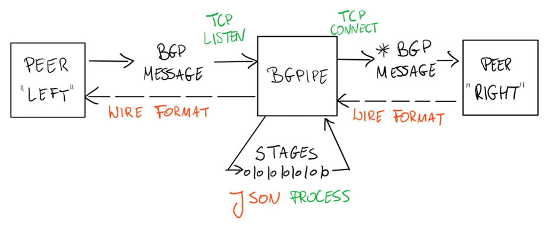

## What is bgpipe?

bgpipe is a unique open-source tool that combines BGP monitoring with active message manipulation capabilities. While traditional BGP tools like BMP or MRT are limited to passive observation, bgpipe operates as a transparent proxy between BGP speakers, allowing real-time inspection and modification of BGP messages.

At its core, bgpipe processes BGP sessions through a series of stages, where each stage performs specific actions such as message filtering, format conversion, or security enhancement. For example, you can:

- Convert BGP messages to JSON and back for easy processing
- Add TCP-MD5 authentication to existing BGP sessions
- Filter BGP updates based on prefix lengths or AS paths
- Apply rate limits and prefix thresholds to prevent flooding attacks
- Archive BGP sessions to MRT files or remote WebSocket servers
- Process messages through external programs like Python scripts

bgpipe operates as a "man-in-the-middle" proxy, but with the explicit purpose of improving BGP session security and manageability. It's particularly useful for scenarios requiring BGP message manipulation, session monitoring, or enhanced security controls.

For practical examples of how to use bgpipe, see the [examples section](examples.md).

## RIPE 88 talk

For a video introduction, you can watch the [RIPE88 bgpipe talk](https://ripe88.ripe.net/archives/video/1365/).

<video preload="metadata" style="width: 100%;" controls poster="https://ripe88.ripe.net/wp-content/themes/fluida-plus/images/webcast.jpg">
<source type="video/mp4" src="https://ripe88.ripe.net/archive/video/pawel-foremski_bgp-pipe-open-source-bgp-reverse-proxy_side_20240523-140239.mp4">
</video>

The talk was summarized in June 2024 by Geoff Huston [on the APNIC blog](https://blog.apnic.net/2024/06/11/routing-topics-at-ripe-88/) as follows:

> Observing and measuring the dynamic behaviour of BGP has used a small set of tools for quite some time. There’s the BGP Monitoring Protocol (BMP, [RFC 7854](https://datatracker.ietf.org/doc/html/rfc7854)), there’s the Multi-threaded Routing Toolkit (MRT) for BGP snapshot and update logs, and if you really want to head back to the earliest days of this work, there are scripts to interrogate a router via the command-line interface, CLI. All of these are observation tools, but they cannot alter the BGP messages that are being passed between BGP speakers.
> 
> The bgpipe tool, presented by Paweł Foremski, is an interesting tool that operates both as a BGP ‘wire sniffer’ but also allows BGP messages to be altered on the fly (Figure 1).
> 
> 
> 
> Internally, the bgpipe process can be configured to invoke supplied ‘callback’ routines when part of a BGP message matches some provided pattern, such as a particular IP prefix, update attribute patterns or such, and it can also be configured to have ‘events’ which processing elements in bgpipe can subscribe to. Simple use cases are to take a BGP session and produce a JSON-formatted log of all BGP messages or take an unencrypted BGP session and add TCP-MD5 encryption. More advanced cases can make use of an external call interface to add route validation checks using RPKI credentials.
> 
> There has been some concern about using IPv6 prefixes to perform a BGP more specific route flooding attack and its possible to use a bgpipe module to perform various forms of prefix thresholds (per origin Autonomous System (AS) or per aggregate prefix) to detect and filter out the effects of such flooding attacks.
> 
> It’s early days in this work, but it is certainly an intriguing and novel BGP tool.
