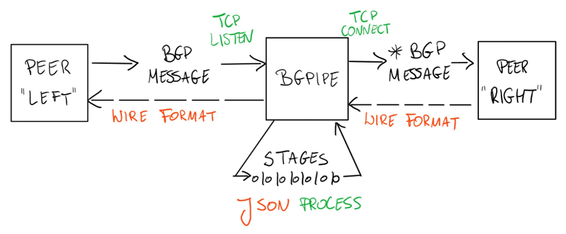

# Introduction

## Why bgpipe

BGP work tends to end up scattered across a pile of single-purpose tools: a speaker library
like [ExaBGP](https://github.com/Exa-Networks/exabgp) or [GoBGP](https://github.com/osrg/gobgp)
to originate and receive routes, ad-hoc scripts to chew through [MRT](https://datatracker.ietf.org/doc/html/rfc6396)
archives or a [BMP](https://datatracker.ietf.org/doc/html/rfc7854) feed, and one-off glue code
whenever two systems need to exchange routes in different formats.
Each of these is its own project, with its own quirks, and none of them compose with the others.

**bgpipe** collapses that pile into one tool: a UNIX-style pipeline of composable stages that
speaks BGP natively. Point it at a live session and it behaves like a scriptable speaker or an
inline proxy; point it at a file or a streaming feed and it becomes a batch/streaming processor;
chain it with `jq`, Python, or another process and it becomes translation glue between BGP and
whatever format that process expects. The same stages and the same command-line syntax cover
all of these - only the input and output stages change.

## Pipeline of stages

A bgpipe command line assembles a pipeline of stages, each doing one thing well, chained together like UNIX pipes. Stages can originate or terminate a session (`listen`, `connect`), filter messages (`grep`, `drop`, `head`), enforce policy (`limit`, `rov`, `aspa`), transform data (`update`, `tag`), measure traffic (`metrics`), bridge formats (`read`, `write`, `stdin`, `stdout`), connect to external systems (`exec`, `pipe`, `websocket`), or tap into live data feeds (`ris-live`, `rv-live`).

Wire two speaker-facing stages on the ends and the pipeline runs inline between two routers, invisibly proxying and rewriting a live session:

```
router A  -->  [ listen -- grep -- rov -- limit -- connect ]  -->  router B
```

Swap the ends for `read`/`write` or a live feed instead, and the exact same middle stages become an offline or streaming processor - no routers, no proxy, just messages in and messages out:

```
MRT archive  -->  [ read -- grep -- tag ]  -->  JSON on stdout
```

Because bgpipe speaks native BGP itself, it can also stand in wherever you'd otherwise reach for a speaker library like ExaBGP - originating routes, replaying an MRT dump onto a session, or scripting a one-off announcement from the command line.
Because every message has a full [JSON representation](json-format.md) (including [Flowspec](flowspec.md)), you can pipe BGP through `jq`, Python, or any tool that handles JSON.
Because it supports [MRT](https://en.wikipedia.org/wiki/Multi-threaded_Routing_Toolkit), [BMP](https://datatracker.ietf.org/doc/html/rfc7854), and [ExaBGP](https://github.com/Exa-Networks/exabgp/) formats, it integrates with existing infrastructure.

The result is a single tool that covers speaker duties, transparent proxying, offline analysis, format translation, and security enforcement -- all from the command line, all composable, all scriptable.

## Watch the talk

See the [quickstart guide](quickstart.md) for a practical introduction. You can also watch the [RIPE 88 bgpipe talk](https://ripe88.ripe.net/archives/video/1365/) below.

<video preload="metadata" style="width: 100%;" controls poster="https://ripe88.ripe.net/wp-content/themes/fluida-plus/images/webcast.jpg">
<source type="video/mp4" src="https://ripe88.ripe.net/archive/video/pawel-foremski_bgp-pipe-open-source-bgp-reverse-proxy_side_20240523-140239.mp4">
</video>

The talk was summarized in June 2024 by Geoff Huston [on the APNIC blog](https://blog.apnic.net/2024/06/11/routing-topics-at-ripe-88/) as follows:

> Observing and measuring the dynamic behaviour of BGP has used a small set of tools for quite some time. There’s the BGP Monitoring Protocol (BMP, [RFC 7854](https://datatracker.ietf.org/doc/html/rfc7854)), there’s the Multi-threaded Routing Toolkit (MRT) for BGP snapshot and update logs, and if you really want to head back to the earliest days of this work, there are scripts to interrogate a router via the command-line interface, CLI. All of these are observation tools, but they cannot alter the BGP messages that are being passed between BGP speakers.
> 
> The bgpipe tool, presented by Paweł Foremski, is an interesting tool that operates both as a BGP ‘wire sniffer’ but also allows BGP messages to be altered on the fly (Figure 1).
> 
> 
> 
> Internally, the bgpipe process can be configured to invoke supplied ‘callback’ routines when part of a BGP message matches some provided pattern, such as a particular IP prefix, update attribute patterns or such, and it can also be configured to have ‘events’ which processing elements in bgpipe can subscribe to. Simple use cases are to take a BGP session and produce a JSON-formatted log of all BGP messages or take an unencrypted BGP session and add TCP-MD5 encryption. More advanced cases can make use of an external call interface to add route validation checks using RPKI credentials.
> 
> There has been some concern about using IPv6 prefixes to perform a BGP more specific route flooding attack and its possible to use a bgpipe module to perform various forms of prefix thresholds (per origin Autonomous System (AS) or per aggregate prefix) to detect and filter out the effects of such flooding attacks.
> 
> It’s early days in this work, but it is certainly an intriguing and novel BGP tool.
