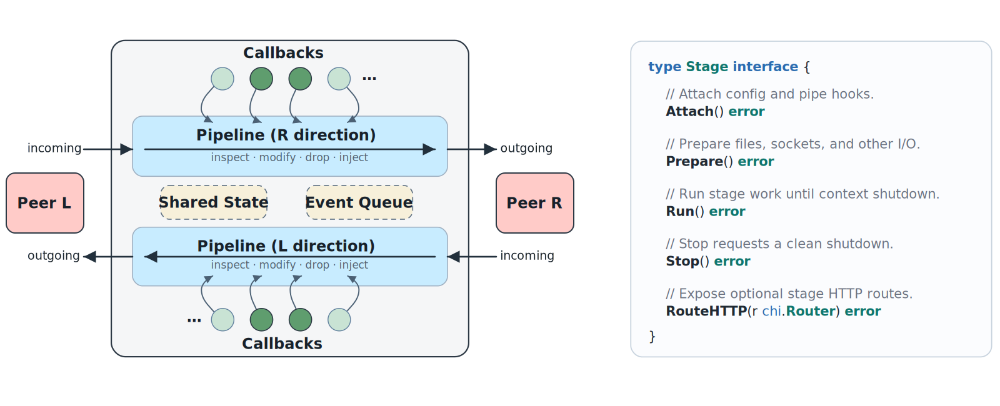

# Introduction

## The gap

The tools available today for working with BGP are fundamentally passive.
[BMP](https://datatracker.ietf.org/doc/html/rfc7854) streams a copy of the RIB to a collector.
[MRT](https://datatracker.ietf.org/doc/html/rfc6396) dumps give you a snapshot you can analyze after the fact.
CLI scraping lets you poll a router's state.
All of these let you *observe* — but none of them let you *act*.

When a route leak propagates, when a hijacked prefix slips through filters, when a peer floods you with deaggregated /48s — the response is mostly manual, expressed in whatever filtering syntax each vendor provides.
There is no standard, programmable layer between BGP speakers where you can inspect, filter, and transform messages in real time.

## A UNIX pipeline for BGP

**bgpipe** fills that gap. It operates as a transparent proxy sitting on the BGP wire between two speakers. Every message flowing in either direction passes through a pipeline of composable stages — each doing one thing well, chained together like UNIX pipes:

```
router A  ──▶  [ listen ── grep ── rov ── limit ── connect ]  ──▶  router B
```

Stages can filter messages (`grep`, `drop`, `head`), enforce policy (`limit`, `rov`, `aspa`), transform data (`update`, `tag`), measure traffic (`metrics`), bridge formats (`read`, `write`, `stdin`, `stdout`), connect to external systems (`exec`, `pipe`, `websocket`), or tap into live data feeds (`ris-live`, `rv-live`).

The same stages work without any routers involved: point `read` at an
[MRT](https://en.wikipedia.org/wiki/Multi-threaded_Routing_Toolkit) archive or
`ris-live` at the RIPE RIS firehose, and bgpipe becomes an offline research tool —
the pipeline doesn't care whether messages come from a live session or a file.

Because bgpipe speaks native BGP on both sides, routers see a normal peer — no protocol changes, no vendor lock-in.
Because every message has a full [JSON representation](json-format.md) (including [Flowspec](flowspec.md)), you can pipe BGP through `jq`, Python, or any tool that handles JSON.
Because it supports [MRT](https://en.wikipedia.org/wiki/Multi-threaded_Routing_Toolkit), [BMP](https://datatracker.ietf.org/doc/html/rfc7854), and [ExaBGP](https://github.com/Exa-Networks/exabgp/) formats, it integrates with existing infrastructure.

The result is a single tool that handles monitoring, filtering, security enforcement, format conversion, and session manipulation — all from the command line, all composable, all scriptable.

## Under the hood

Internally, bgpipe runs two message pipelines — one per direction — and stages
attach callbacks that can inspect, modify, drop, or inject messages, coordinated
through shared state and an event queue. Each stage implements a small Go
interface shown on the right:



## Watch the talk

See the [quickstart guide](quickstart.md) for a practical introduction. You can also watch the [RIPE 88 bgpipe talk](https://ripe88.ripe.net/archives/video/1365/) below.

<video preload="metadata" style="width: 100%;" controls poster="https://ripe88.ripe.net/wp-content/themes/fluida-plus/images/webcast.jpg">
<source type="video/mp4" src="https://ripe88.ripe.net/archive/video/pawel-foremski_bgp-pipe-open-source-bgp-reverse-proxy_side_20240523-140239.mp4">
</video>

The talk was summarized in June 2024 by Geoff Huston [on the APNIC blog](https://blog.apnic.net/2024/06/11/routing-topics-at-ripe-88/) as follows:

> Observing and measuring the dynamic behaviour of BGP has used a small set of tools for quite some time. There’s the BGP Monitoring Protocol (BMP, [RFC 7854](https://datatracker.ietf.org/doc/html/rfc7854)), there’s the Multi-threaded Routing Toolkit (MRT) for BGP snapshot and update logs, and if you really want to head back to the earliest days of this work, there are scripts to interrogate a router via the command-line interface, CLI. All of these are observation tools, but they cannot alter the BGP messages that are being passed between BGP speakers.
> 
> The bgpipe tool, presented by Paweł Foremski, is an interesting tool that operates both as a BGP ‘wire sniffer’ but also allows BGP messages to be altered on the fly (Figure 1).
> 
> 
> 
> Internally, the bgpipe process can be configured to invoke supplied ‘callback’ routines when part of a BGP message matches some provided pattern, such as a particular IP prefix, update attribute patterns or such, and it can also be configured to have ‘events’ which processing elements in bgpipe can subscribe to. Simple use cases are to take a BGP session and produce a JSON-formatted log of all BGP messages or take an unencrypted BGP session and add TCP-MD5 encryption. More advanced cases can make use of an external call interface to add route validation checks using RPKI credentials.
> 
> There has been some concern about using IPv6 prefixes to perform a BGP more specific route flooding attack and its possible to use a bgpipe module to perform various forms of prefix thresholds (per origin Autonomous System (AS) or per aggregate prefix) to detect and filter out the effects of such flooding attacks.
> 
> It’s early days in this work, but it is certainly an intriguing and novel BGP tool.
